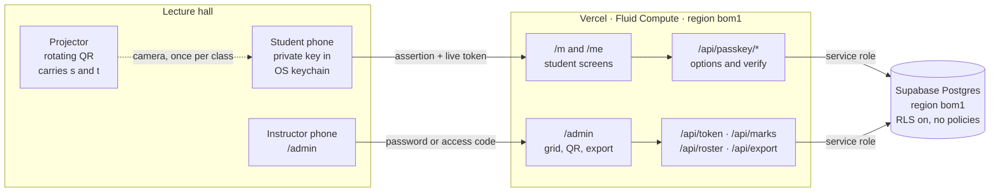
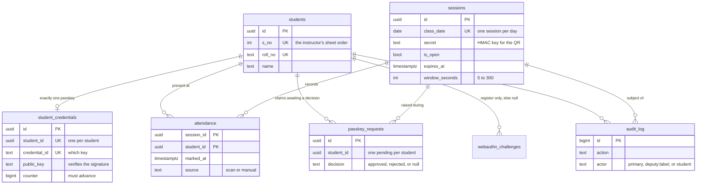
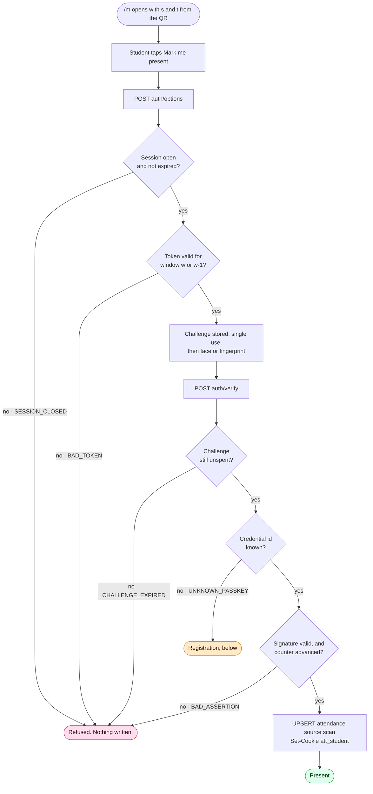
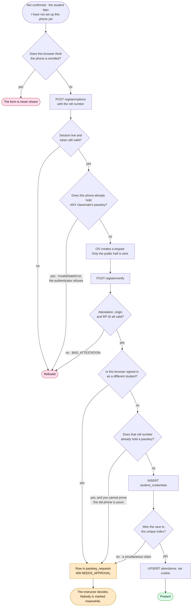
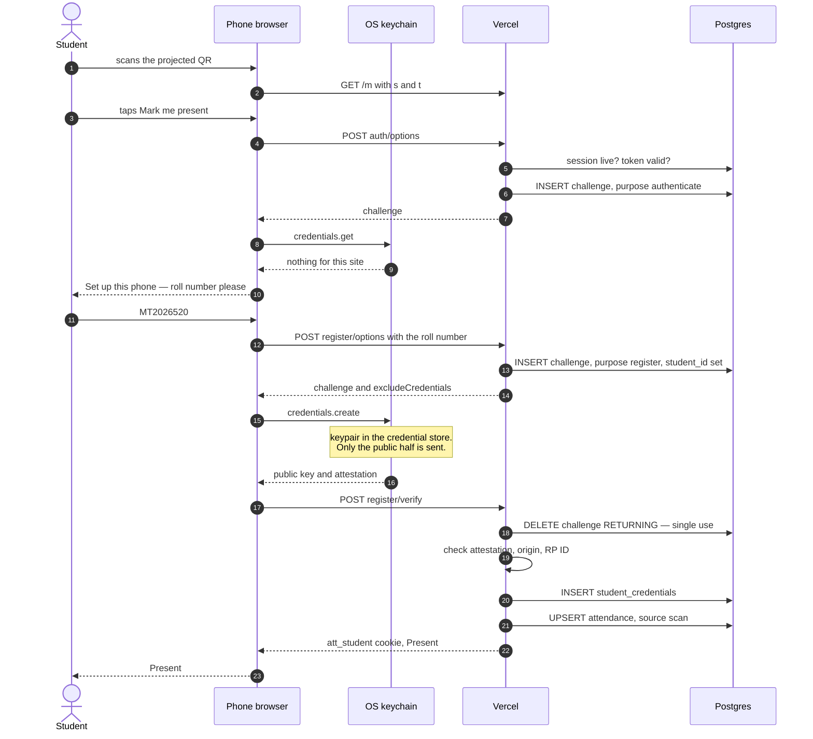
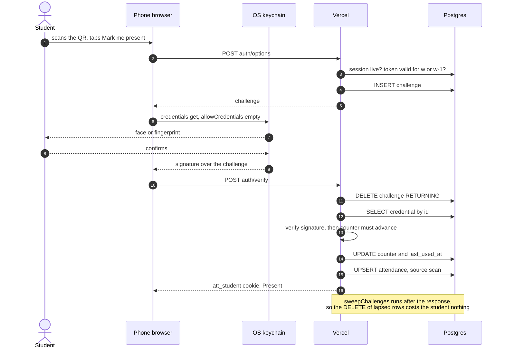
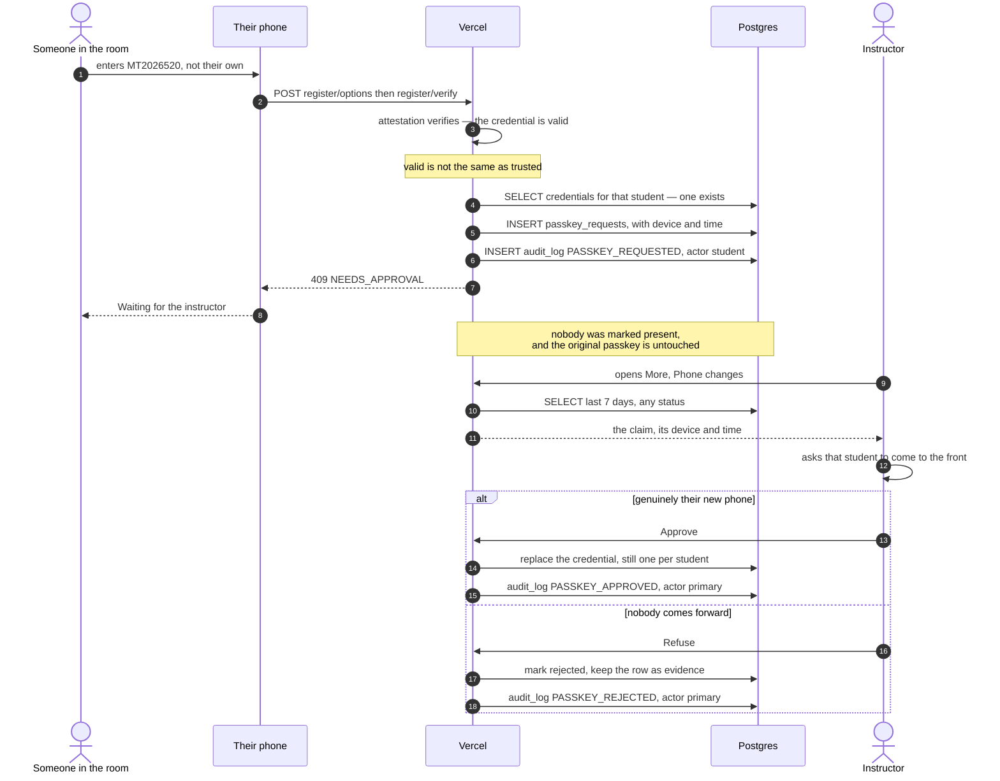
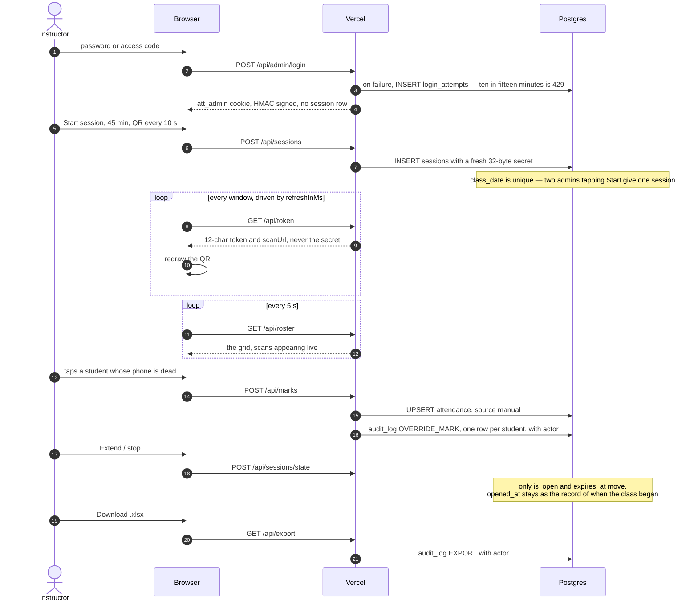

# QR Attendance

A class attendance system. The instructor projects a QR code that rotates on a
period they choose — 5 to 300 seconds, 15 by default; students scan it with their
phone and are marked present for that date. The instructor can download an
`.xlsx` matching their existing sheet layout exactly.

No email, no student passwords. Identity is a **passkey**: a private key held by
the phone's credential store, confirmed with a face or a fingerprint, which the
OS carries to a new phone by itself. Nothing to reset when a student clears their
browser data. The one case that still needs a person — a genuinely lost phone —
goes through an approval queue rather than a reset button, for reasons under
[Lost or wiped phone](#lost-or-wiped-phone).

**Postgres is the single source of truth.** Excel is generated on demand from it,
never the other way round. Nothing writes to a spreadsheet file at runtime.

## Stack

Next.js (App Router) on Vercel · Supabase Postgres · `exceljs` for the export ·
no auth library — the admin is a single password in an env var.

## Architecture

Three actors, one server, one database. The projector and the phone never talk to
each other over the network — the QR is the only channel between them, and that
is the point: it cannot be relayed without being re-photographed.



Everything server-side talks to Postgres with the service role key and RLS is on
with **no policies**, so a leaked anon key grants nothing. There is no auth
library and no session table: the admin cookie and the student cookie are both
self-describing and HMAC-signed, so a request needs one database read fewer.

### Data model



Three constraints do work that application code would otherwise have to
remember, and would get wrong under concurrency:

- `attendance` is keyed on `(session_id, student_id)`, so double-marking is not
  something to guard against — it is not expressible.
- `sessions.class_date` is `unique`, so two admins tapping **Start** at the same
  moment produce one session, not two.
- `student_credentials` has a unique index on `student_id`, so three simultaneous
  claims on one roll number produce one credential. A check-then-insert has a
  window here, and it was measured letting **two of three** through.

## How it flows

The first two diagrams are the **decision logic** — every check, in the order the
server applies it, and what each refusal returns. The four after them are
**sequences**, which answer a different question: who talks to whom, how many
round trips it costs, and where the boundary between the browser and the OS
keychain falls. Same flows, deliberately different cross-sections.

### Marking present, when the phone already has a passkey

The ordinary case, and the one that happens 46 times out of 47. Two round trips,
because WebAuthn needs a challenge before the biometric and a signature after it.
Each refusal carries the code the screen has copy for.



Note what this does **not** contain: any path where typing a roll number alone
marks somebody present, and any path from the cookie to the `attendance` table.
Both are deliberate — see decision 5, **Bearer tokens read, signatures write**.

### Getting a passkey in the first place

Reached only by a deliberate tap after a failed prompt — never as the place a
cancelled fingerprint dialog lands you, which is the bug this shape exists to
prevent. The roll number is asked for exactly once in the term.

Three of these gates were added after one phone was found collecting passkeys for
classmates who had not enrolled: the local flag, the authenticator's exclusion
check, and the signed-in-as-someone-else check. The fork at the bottom is the
older argument and still the main one — claiming an *unclaimed* roll number needs
only presence, claiming one that is already taken needs a person.



### A student's first class

Now the same journey as a sequence, because the interesting part is not the
branching but the **two round trips and the keychain boundary** — where the
keypair is made, and what crosses back to the server.

The roll number is typed exactly once in the term, and it is a *label*, not a
key. The phone generates the identity; the roll number only decides which
`student_id` gets written into the passkey.



### Every later class

Nothing is typed, and the roll number is never sent again. The passkey is
discoverable, so its `userHandle` tells the server who signed — which is also why
`allowCredentials` is empty and this endpoint leaks nothing about who is enrolled.



### A contested roll number

The case that reshaped the design. A stranger in the room holding the live QR
types a classmate's roll number. The server cannot tell that apart from the
classmate's own new phone, so it stops guessing and asks a human.



### The instructor running a class



Marking by hand is deliberately **not** gated on the session being open: the grid
has to stay editable after class, and a backdated session is created closed so it
never has a QR at all. Scanning is gated on all three of a live session, a live
token and a signature.

## Architectural decisions

The reasoning behind each of these is in the sections below; this is the index.
Every one was either measured or arrived at by breaking the previous version.

| # | Decision | Why | Where |
|---|---|---|---|
| 1 | **Postgres is the source of truth.** Excel is generated on demand, never written to at runtime. | A spreadsheet cannot be read concurrently by 47 phones, and a file that is both input and output has no answer for "which copy is right". | [Export](#export) |
| 2 | **No auth library.** The admin is one password in an env var; both cookies are self-describing and HMAC-signed. | There is one admin and no sign-up, no reset, no roles beyond deputy. A library would add a dependency and a session table to solve problems this app does not have. | [Cookies and HTTPS](#cookies-and-https) |
| 3 | **Identity is a passkey**, after a localStorage UUID and then an httpOnly cookie. | Both predecessors were bearer tokens — copyable, forwardable, and destroyable by Safari's 7-day cap. A passkey cannot be read by a page or handed to a friend, and using it needs the device unlock. | [Why identity moved…](#why-identity-moved-from-localstorage-to-a-cookie-to-passkeys) · [What "the key never leaves the phone" actually means](#what-the-key-never-leaves-the-phone-actually-means) |
| 4 | **Two independent proofs to be marked present:** *who* is a signature, *where* is a live rotating token. | Neither substitutes for the other. A passkey off campus proves identity but not presence; a photographed QR proves presence but not identity. | [Identity](#identity) |
| 5 | **Bearer tokens read, signatures write.** The `att_student` cookie can fetch `/me` and nothing else. | The cookie is copyable and a friend *can* paste it — accepted, because its whole power is reading one student's own percentage. Attendance always needs a fresh assertion. | [Identity](#identity) |
| 6 | **One passkey per student, enforced by a unique index** rather than by checking first. | Postgres has no race window; check-then-insert does, and it let two of three simultaneous claims through when tested. | [Guarding the credentials](#guarding-the-credentials) |
| 7 | **An approval queue, not a reset button.** | A lost phone and a stranger's phone are indistinguishable to the server. So a person decides, and every refused claim becomes evidence with a device and a time on it. | [Lost or wiped phone](#lost-or-wiped-phone) |
| 8 | **The queue shows facts, not guesses.** No "already marked today", no "old phone last used". | Neither discriminates: a proxy attempt happens while the student is absent, and so does a genuine lost phone. A hint that only fires in the rare case invites trusting it instead of asking the student. | [The phone-changes panel](#the-phone-changes-panel) |
| 9 | **Registration is authorised by presence**, not by an admin-controlled window. **Partly wrong** — the window was removed on reasoning that did not hold, and the gap it left is still open. | Holding a live QR token does mean being in the room, and that part stands. But the case the window defended was called "self-correcting" when it is not: the victim is marked *present*, so nobody complains and nothing surfaces. | [Registration, and the window that was wrong to remove](#registration-and-the-window-that-was-wrong-to-remove) |
| 16 | **One passkey per device**, via `excludeCredentials` carrying the whole class. | `UNIQUE(student_id)` gave one passkey per student and nothing gave one per device, so a single handset could collect a passkey for every unenrolled classmate and mark them present all term. Enforced by the authenticator, so it stops a phone and not a script. | [One phone, many roll numbers](#one-phone-many-roll-numbers) |
| 10 | **Housekeeping runs behind the response** via `after()`, with no cron. | Both swept tables are self-limiting by query, so the deletes are tidying, not correctness — and have no business costing a student a round trip. One less thing that can silently stop running. | [The phone-changes panel](#the-phone-changes-panel) |
| 11 | **RLS on with no policies.** Every server query uses the service role. | A leaked anon key then grants nothing at all, rather than whatever the policies happen to permit. | [Permissions](#permissions) |
| 12 | **The roster is cached in memory for 30 seconds**, and any write clears it. | Read on nearly every request, changed a handful of times a term. Thirty seconds and not thirty minutes because several serverless instances cannot tell each other about a new student. | [Caching](#caching) |
| 13 | **The function region is pinned next to the database.** | Left at the default, compute ran in Washington against a database in Mumbai: nine sequential round trips made sign-in 2800 ms. Pinning it to `bom1` took that to 305 ms. | [Function region](#function-region) |
| 14 | **The audit log records human decisions, not scans.** | 47 scans a class would bury the six overrides that someone might actually have to justify. The `attendance` row with `source = 'scan'` is the record of a scan. | [The audit log](#the-audit-log) |
| 15 | **QR rotation speed is the only real control over relaying.** | No identity mechanism stops a student photographing the QR for an absent friend who then signs with their own face. Ten seconds gives a 10–20 s usable window against a 15–30 s realistic relay. | [What none of this fixes](#what-none-of-this-fixes) |

## Setup

### 1. Create the database

In the Supabase SQL editor, run [`supabase/schema.sql`](supabase/schema.sql),
then seed the roster (`npm run seed`). That is the whole setup — `schema.sql` is
the single source of truth for the database and is idempotent, so re-running it
is safe.

There is no migrations folder. There used to be four numbered files, but the app
never went live: it existed only in demo while the identity design was being
worked out, so when it changed for the last time the tables were dropped and
recreated and the roster re-seeded from the spreadsheet. Migrating demo data
would have been ceremony over 47 rows that regenerate in a second, and it would
have left the schema as a pile of diffs to replay rather than one file to read.

Two scripts exist for that path:

| Script | What it does |
|---|---|
| [`supabase/reset.sql`](supabase/reset.sql) | drops every table — **only** safe while the roster is regenerable from the spreadsheet |
| [`supabase/alter-001-one-passkey.sql`](supabase/alter-001-one-passkey.sql) | the one-passkey-per-student change, kept as the record of it |

`alter-001` is history rather than a step: `schema.sql` already contains
everything it did. It is worth reading if you want to see what changed and why.
The code it replaced is in [`docs/superseded/`](docs/superseded/).

**Before students register, settle your final hostname.** A passkey is bound to
its domain, so moving from `*.vercel.app` to a real domain later invalidates
every passkey and the whole class has to register again. Set `APP_ORIGIN` to the
domain you intend to keep.

### 2. Configure the app

```bash
cp .env.example .env.local
```

| Variable | Where it comes from |
|---|---|
| `NEXT_PUBLIC_SUPABASE_URL` | Supabase → Project Settings → API |
| `SUPABASE_SERVICE_ROLE_KEY` | same page — **server-side only** |
| `ADMIN_PASSWORD` | your choice; changing it signs out every admin session |
| `CLASS_TIMEZONE` | optional, defaults to `Asia/Kolkata` |
| `ADMIN_ROLL_NO` | optional — the instructor's own roll number, if they are one of the 47 |

### 3. Seed the roster

```bash
npm run seed -- "Soft Skills.xlsx"
```

Reads `Roll NO.` (B), `Name` (C) and `Mail Id` (D) from rows 2–48 and preserves
`S.No` (A) as the sort order. Idempotent: it upserts on `roll_no` and never
clears a device binding, so you can re-run it after fixing a name in the sheet.

### 4. Run

```bash
npm run dev
```

## Using it

### First class of the term

1. Open `/admin` and sign in.
2. **Start session**, then **Show QR** and project it.
3. Students scan, type their roll number once, and are marked present.

### Every class after that

**Start session** — pick how long attendance stays open and how fast the QR
rotates — then **Show QR**. Students scan; the grid fills in live.

| Choice | Presets | Range |
|---|---|---|
| Open for | 15 / 30 / 45 / 60 / 90 / 120 min | 1 min – 10 hr |
| QR rotates every | 10 / 15 / 30 / 60 / 120 s | 5 – 300 s |

A shorter rotation is harder to forward; a longer one is easier to scan on a
weak camera. The grace window is always one period, so choosing 60 s also means
a screenshot stays usable for up to two minutes.

While a session is running, **Extend / stop** offers:

- **Extend** by 5, 10, 15 or 30 minutes. Time is added to the current end time,
  so extending twice adds twice. A session that is still running stays
  extendable even after midnight, when its `class_date` is legitimately
  yesterday; a session that has *lapsed* can only be reopened on its own date,
  so a backdated one never becomes scannable.
- **QR rotation** can be retuned mid-class. The projected code refreshes within
  one old period; tokens minted under the previous setting stop working.
- **Stop session** ends the QR immediately. Taps on the grid keep working.

### The instructor is one of the 47

Set `ADMIN_ROLL_NO` to their roll number and the grid marks that row **YOU**, so
they can find and tap it without hunting. They mark their own attendance the same
way as anyone else's — by scanning with their phone, or by tapping their row.

### The roster grid

Two sections, because they are used differently.

```
✓  scanned      ✎  marked by hand      ·  absent
```

**Marked** holds anyone already present. Scans land here on their own within five
seconds. These rows are **not tappable**: the one mistake that really costs
something is absenting a student who did turn up, and a stray thumb should not be
able to do it. Unmarking lives in that row's `⋯` menu, where it takes a
deliberate second tap.

Removing a mark asks first, but only when the student made it themselves: a `✓`
scan opens a dialog naming who they are and the minute they scanned, because that
mark is their own evidence of having been there. A `✎` mark the admin made by
hand goes straight through — it is theirs to undo. Either way an
`OVERRIDE_UNMARK` entry lands in the audit log.

**Not marked** holds everyone else, with a search box for when typing three
letters beats scrolling 47 rows, and **Select all** for the days when nearly
everyone is present — stage the lot, then un-stage the few who are not.

Select all is scoped to what is on screen. With a search applied it reads
"Select all 6 shown" and takes only those six; a control that quietly staged 41
hidden students would be a trap.

Tapping a row **stages** it — no request, no waiting. A bar appears at the bottom
showing how many are staged, with **Save** and **Discard**; it is absent when
nothing is staged.

Save writes the whole batch in one request. That is not only about speed:

- **It is idempotent.** `/api/marks` only inserts, so saving twice — or three
  saves racing — leaves exactly one row. The per-tap toggle it replaced read the
  current state before flipping it, so two taps landing together both saw
  "absent", both inserted, and the student ended up *marked* when two taps should
  have cancelled out. That was the miscounting.
- **A scan is never overwritten.** If somebody scans while staged they move to
  Marked as `✓` and drop out of the batch, because scanning is the better
  evidence. The save says so: *"Saved 5. 1 had already scanned."*
- **Ten taps cost one round trip.** Ten rows take about 380 ms, against the
  twelve seconds ten sequential writes used to take at ~1.5 s each.

An optional reason accompanies the save rather than each tap, which is both
simpler and a more honest description of what it refers to.

The date picker loads any past session into the same two-section view, so a
correction found a week later needs no new interaction to learn.

### Forgot to start a session

**More → Session for a past date**. This creates a session with `is_open = false`
and the chosen `class_date`, so no QR is ever generated for it. It opens straight
into the grid; tap through from memory or a paper list. Every mark lands as `✎`.

A date that already has a session is refused, and the existing one is opened
instead.

### Registration, and the window that was wrong to remove

A phone with no passkey can be offered registration. There used to be an
admin-controlled window; it was removed, and the reasoning for removing it was
wrong. Both halves are recorded here because the mistake is more instructive than
the fix.

**What the README used to say:** the window "only ever defended against somebody
claiming an **unclaimed** roll number unilaterally, and that case is
self-correcting: the real student is told the number is taken and the admin sorts
it out."

**Why that is wrong:** the victim is marked **present**. They have no reason to
complain. The attacker has no reason to complain. If the victim ever does try to
enrol, they land in the approval queue looking exactly like an ordinary lost
phone. Nobody is unhappy, so nothing surfaces — it is a stable state, not a
self-correcting one. "Self-correcting" assumed the harm was visible to the person
harmed, and it is not.

What authorises registration is **presence**: creating a passkey requires a live
QR token, which only exists on the projector in the room. That part still holds,
and it is why enrolling needs no admin and no email.

### One phone, many roll numbers

The hole that reasoning left open, found in production by cancelling a
fingerprint prompt.

Cancelling led to the enrolment form. That is not a slip so much as an
unavoidable ambiguity — WebAuthn will not tell a page whether a passkey exists,
so a cancelled prompt and an empty keychain are the same event — but this screen
resolved the ambiguity by offering the form, which handed it to anybody. Enter a
classmate's roll number and their passkey is created on your phone.

**`UNIQUE(student_id)` guaranteed one passkey per student. Nothing guaranteed one
passkey per device.** Reproduced before fixing, on one handset:

```
their own roll number registers                            ok
MT2026008 claimed from the same phone                      ok
MT2026020 claimed from the same phone                      ok
MT2026026 claimed from the same phone                      ok
MT2026028 claimed from the same phone                      ok
five passkeys now exist, all on one device                 ok
nothing is waiting in the approval queue                   ok
```

Then, with the attendance cleared and the keychain untouched — next week:

```
all five present, one device, nothing typed                ok
```

So it was not one roll number and not one class. One phone could hold a passkey
for every student who had not enrolled yet and mark them present for the rest of
the term, needing nothing from those students ever again.

An edge test had asserted this **as a feature** — "one phone may register a
second student … a shared family phone, or the admin's own phone". That is the
second time in this project a test encoded a vulnerability as intended
behaviour. Both times the test was written from the same reasoning as the code,
which is exactly when a test is worth least.

#### The fix, in three layers

**1. The authenticator refuses.** `excludeCredentials` now carries *every*
credential in the class, not only the roll number being claimed. A phone already
holding any classmate's passkey cannot create a second one — it throws
`InvalidStateError` before the server is involved. Verified against Chromium's
real WebAuthn implementation, not only the software authenticator in the suites:

```
the exclusion list carries the whole class, not just the roll number asked for  ok
a real authenticator refuses a second passkey on the same phone                 ok
the keychain still holds exactly one credential                                 ok
```

This is enforced by the phone. A caller scripting WebAuthn by hand can drop the
list, and the server cannot detect it: a platform authenticator reports no device
identity by design, and the AAGUID names a model rather than a handset. So this
stops a student with a phone, which is the threat here, and does not stop someone
writing their own client.

**Verified on Chromium only, and it cannot be otherwise in CI.** Playwright's
virtual authenticator is a Chrome DevTools Protocol feature, so WebKit has no way
to hold a credential and the registration ceremony is unreachable there. Every
statement about iPhone behaviour in this section is therefore an inference from
Chromium plus the specification. **It wants confirming on a real iPhone**, and it
is the single most valuable thing left to test by hand.

**2. The screen stops guessing.** A failed prompt now says "Not confirmed" and
offers **Try again**. Enrolment is a separate, deliberate tap, and it is not
offered at all when a local flag says this phone has already been enrolled. The
flag is clearable, so it is an affordance rather than a control — its job is to
stop a cancelled prompt from *handing over* the form.

This layer needs no authenticator, so unlike layer 1 it **is** checked on WebKit
as well as Chromium — eight assertions per engine, on the iPhone 14 and Pixel 7
presets. That matters, because until it was added the scan screen had never once
been rendered in WebKit by any suite: the whole passkey journey was Chromium-only
and every claim about Safari was an inference.

One measured difference between the engines, and the reason not to build on it:
with no authenticator attached, `navigator.credentials.get()` rejects with
**`NotAllowedError` on WebKit** and **`NotSupportedError` on Chromium**. The
client catches any exception rather than matching on the name, so both behave
identically. Matching on names here would have produced a bug on exactly one
platform.

**3. The server queues cross-student claims.** Enrolling a roll number from a
browser that already holds a session for a *different* student is never the
innocent first-time case, whatever else it is. It goes to the approval queue with
an audit line saying so, rather than being written. This catches the scripted
caller from layer 1 — as long as it keeps its cookie.

#### What is still open

A caller with **no cookie, no real authenticator, and a roll number nobody has
enrolled** can still claim it. Proved, deliberately, so it is not a surprise:

```
claiming a third roll number: 200 REGISTERED
^ THIS IS THE RESIDUAL GAP
```

The same is true, without any scripting, of a **second physical device**: a
laptop or an old phone with an empty keychain can enrol one unclaimed roll
number.

Only gating first-time enrolment closes this, which means the window that was
deleted — now with a reason that actually holds. Two shapes of it:

- **An enrolment window on the session.** Open it for the first class, watch the
  count reach the roster size, close it. Later joiners then go through the
  approval queue like anyone else. Cheap, and leaves one supervised window of
  exposure.
- **Approve every first enrolment.** No window at all, at the cost of roughly one
  tap per student during the first class.

Neither is implemented. Until one is, treat the first class as the moment that
matters: **the enrolment list is worth checking against who was actually in the
room**, because that is when every roll number is unclaimed and therefore
claimable. `audit_log` holds every `PASSKEY_REGISTERED` with a timestamp and a
device label for exactly that check.

### A student joins late

**More → Roster → Add student.** Roll number and name are required, email is
optional. They take the next `S.No`, so they land at the end of the roster and of
the exported sheet rather than shifting everybody else's row, and classes already
held stay blank for them — which is the truth.

Adding students is the instructor's own operation; a deputy covering one class
cannot change who is on the register.

### Caching

`students` is read on nearly every request and changes a handful of times a term,
so `listStudents()` keeps it in memory for **30 seconds** and any write clears it.

Thirty seconds, not thirty days. This runs as several serverless instances with no
way to tell the others that a student was added, so a long TTL would mean an
instance serving a roster that is wrong for as long as the TTL lasts. The
instance that performs the write clears its own copy at once, so the admin who
added someone always sees them immediately.

Measured against Supabase from a laptop, roughly 300 ms per round trip:

| | before | after |
|---|---|---|
| `GET /api/roster` | 1092 ms (611–1182) | **604 ms** (577–697) |
| `POST /api/marks` | 1073 ms | **903 ms** |

The roster gain was a surprise — those queries already run in `Promise.all`, so
caching one was not expected to help. Removing it both lowered and steadied the
time, which points at connection contention rather than the queries genuinely
running in parallel.

What caching does **not** fix: the grid re-sends all 47 student records every
five seconds, 8.6 KB a poll, about 6 MB across an hour of class, almost all of it
names and roll numbers that never change. Splitting the poll into a rarely
fetched roster and a small marks-only payload is the larger win, and is a
client-side change rather than a cache.

### Lost or wiped phone

Most of the time, nothing for the admin to do.

**Cleared cookies, cleared site data, a new phone in the same ecosystem** — all
handled by the phone itself. The passkey lives in the OS credential store and
syncs through iCloud Keychain or Google Password Manager, so it is already on the
new device. `/me` offers **Sign in**, which is one biometric prompt and about
175 ms.

**A genuinely lost phone, or a move from iPhone to Android**, needs a decision by
a person, and this is the part that changed late.

Each student may hold **one** passkey, enforced by a unique index on
`student_id`. Entering a roll number that already has one does not create a
second — it files a **request**, visible under **More → Phone changes**, and the
instructor approves or refuses it. Approving *replaces* the old credential, so
one-per-student still holds afterwards.

That is deliberately more friction than the design it replaced, and the reason is
a hole the earlier one had. `student_credentials` was originally one-to-many, so
that switching ecosystems needed nobody's permission. But a roll number is not a
secret — it is printed on ID cards and read aloud in class — and the only thing
authorising registration is a live QR token, which everybody in the room can see.
So a stranger holding the projected QR could type a classmate's roll number, add
*their own* passkey to that student's record, and mark them present in every
class from then on. This was found by testing the attack, having previously been
written up as a feature.

There is no way for the server to tell a lost phone from an opportunist: both are
an unknown device asking for a roll number that is taken. So it stops asking, and
puts the question to somebody who is standing in the room with all 47 students.

Attendance is never affected by any of this. Those rows key on `student_id`, so
the record of who was present survives any number of device changes.

The only case still needing manual marking is a phone too old for passkeys —
below iOS 16 or Android 9. Tap that student on the grid. That is deliberate: a
weaker second sign-in path would just become the one worth attacking.

### The phone-changes panel

**More → Phone changes.** Seven days of claims, filterable by All / Pending /
Approved / Refused. Each row is the roll number, the name, the device that asked,
when, and what was decided. Two buttons on the pending ones.

It offers **no opinion on whether a claim is honest**, and that is a decision
rather than an omission. An earlier version showed whether the student was
already marked present today, and when their existing passkey last worked. Both
were removed: a proxy attempt happens while the student is absent, and so does a
genuine lost phone, so the common case for both looks identical. A hint that only
fires in the rare case is worse than no hint, because it invites trusting it
instead of asking the student — and the instructor has a far better instrument
available, which is to ask them to come to the front.

What the history *is* good for is patterns. The same roll number claimed three
times in a week is visible at a glance, and no heuristic was needed to surface it.

A refused claim is evidence, so it stays in the list for the week. The permanent
record is `audit_log`, which keeps every `PASSKEY_REQUESTED`, `PASSKEY_APPROVED`
and `PASSKEY_REJECTED` for good.

Rows past seven days are deleted, and so are lapsed WebAuthn challenges. Both
sweeps live in [`src/lib/sweep.ts`](src/lib/sweep.ts) and neither is a scheduler.

The reasoning is the same for both: each table is already self-limiting *by
query*, not by cleanup. A lapsed challenge cannot be consumed because
consumption filters on `expires_at`; a stale request is invisible because the
panel filters on `requested_at`. Deleting the rows is therefore tidying, and
tidying has no business costing a student a round trip to Supabase while they
wait for a fingerprint prompt.

So both run *after* the response is sent, via `after()` from `next/server`. A
bare un-awaited promise would not do — on Vercel the container can be frozen the
moment the response is flushed, abandoning the delete halfway. Errors are
dropped: a cleanup that did not run has no visible consequence, the next call
attempts it again, and a failure here must never turn a working sign-in into a
broken one.

Measured on production, `POST /api/passkey/session/options` — the challenge every
sign-in starts with. Both deployments hit alternately from the same machine, both
warmed first, with 40 lapsed rows seeded so the DELETE had real work to do:

| | median | p90 | max |
|---|---|---|---|
| prune awaited in the request | 170 ms | 188 ms | 471 ms |
| prune behind the response | **153 ms** | **173 ms** | **176 ms** |

Roughly one Supabase round trip off the median — a modest 17 ms, and worth
stating plainly because a first pass at this measurement suggested far more. That
run compared a fresh deployment against a number taken minutes earlier and
reported 364 ms median against 2213 ms max; almost all of that spread was cold
starts, not the prune. Warm and interleaved is the only comparison that means
anything here.

The tail is the better argument: 471 ms down to 176 ms. The awaited version's
worst case is a student waiting on a DELETE that has nothing to do with them,
and a lecture hall is where that gets noticed.

One ordering hazard

One ordering hazard, worth knowing because it is invisible in a unit test: the
sweep is registered *before* the fresh challenge is stored but runs *after* it.
A predicate that caught the new row would delete the challenge the student is
about to sign with, and sign-ins would fail intermittently. The edge suite
asserts the minted challenge survives its own sweep and is still recognised by
the verify step.

If nothing is ever called, nothing is cleaned — accepted, for tables holding a
handful of rows a term.

A deputy can **see** the panel but not decide anything: both `decide` and
`remove` return `403`. Somebody covering one class needs to know a student is
stuck, but changing who owns a passkey belongs to the person who owns the
register.

### What a student sees

`/me` shows a **month calendar** of their own attendance — green for present, red
for absent, blank where no class was held — with the headline count and
percentage above it and every class listed below. Month arrows move between the
months that actually had classes.

An empty square means no class was held, which is materially different from being
absent; a flat list of dates cannot show that distinction at a glance.

### Export

**Download .xlsx** on the admin page, or `GET /api/export`. Generated from
Postgres on every request.

| Col | Header | Content |
|---|---|---|
| A | `S.No` | 1..47 |
| B | `Roll NO.` | roll number |
| C | `Name ` | name (trailing space matches the original) |
| D | `Mail Id` | email |
| E | `Date:` | label only |
| F–U | one per session | `✓` where an attendance row exists |
| V | `Total \nAttendnacs` | `=COUNTIF(F2:U2,"✓")` |
| W | `Attendnacs \n%` | `=IF(COUNT($F$1:$U$1)=0,"",V2/COUNT($F$1:$U$1))`, `0.0%` |

`V` and `W` are live formulas, not computed values. Scanned and manual marks both
write a plain `✓` — provenance stays out of this file so it remains diffable
against the instructor's own copy.

## Why identity moved from localStorage, to a cookie, to passkeys

This changed three times. Each step was forced by a specific failure, and the
alternatives that look obvious were each rejected for a concrete reason. The
superseded code is preserved under [`docs/superseded/`](docs/superseded/).

### 1. A UUID in localStorage — the original design

On first scan the browser generated `crypto.randomUUID()`, kept it in
`localStorage`, and the server mapped it to a roll number. One phone, one
student, nothing to type after the first time.

It broke for three separate reasons:

**Safari deletes it.** Intelligent Tracking Prevention removes script-writable
storage — `localStorage`, IndexedDB, cookies written by JavaScript — after
roughly seven days of browser use without interaction on the site. **A weekly
class sits exactly on that boundary.** Reproduced on WebKit: register in week
one, purge, scan in week two, and the student was offered registration afresh
and then told *"that roll number is already registered on another phone"*. It
was their own phone. Every student, every week, needing an admin reset.

**An installed web app cannot see it.** iOS gives a home-screen web app its own
storage container. Register in Safari and the installed app sees nothing, and
vice versa — the same phone holding two unrelated identities, only one of which
can own the roll number. Worse, on iOS a QR scanned from the Camera app opens
the *default browser*, never the installed app, so a student who installed the
app could never scan into the container holding their binding.

**Anything the browser can read, a student can send.** The UUID was a bearer
token in readable storage.

### 2. Adding an httpOnly cookie — a real fix, but partial

A cookie set by the *server* is not script-writable, so ITP's seven-day cap does
not apply to it. Holding the same id in both places, with each recognised scan
rewriting the other, made either one surviving sufficient. This genuinely fixed
the weekly purge, and it is verified on production in both engines.

It did not fix the rest. Cookies are per-container too, so the iOS
installed-app split survived. Clearing website data still required an admin.
And it was still a bearer token — `httpOnly` stops *script* reading it, not a
determined student.

### 3. Passkeys — where it landed

A passkey lives in the OS credential store — iCloud Keychain, Google Password
Manager — not in the browser's storage box. That single fact resolves every
item above:

| Failure | Under passkeys |
|---|---|
| Safari's 7-day purge | Not web storage; unaffected |
| iOS installed-app container | Both containers reach the same keychain |
| Two Vercel hostnames | No per-origin storage carries identity |
| Cleared site data, private mode | Unaffected |
| New phone, same ecosystem | Syncs automatically |
| Admin device resets | Gone for cookies, cleared data and same-ecosystem phones. A genuinely lost phone needs one approval. |

And it is the first version that is not a bearer token: no page can read the
private key, a student cannot hand it over the way they could hand over a cookie,
and using it needs the device unlock. See
[What "the key never leaves the phone" actually means](#what-the-key-never-leaves-the-phone-actually-means)
for the precise version of that claim, which is weaker than it is usually
written.

**Two things must both hold to be marked present, and neither substitutes for
the other:**

- **who** — a passkey signature over a server-issued, single-use challenge
- **where** — a live rotating token, which only exists on the projector

The session cookie set after a successful assertion (`att_student`) is *only*
so `/me` can be read without a biometric prompt. It cannot mark anyone present.

### What we care about, and what the OS handles

Handled for us: key generation, biometric prompts, sync, backup, and migration
to a new phone. We store a credential id and a public key, and never see a
private key.

Ours to get right:

1. **One passkey per student**, enforced by a unique index on `student_id` —
   not by reading the table first and then writing. Postgres has no race window;
   check-then-insert does, and it was measured: three simultaneous claims on the
   same roll number let **two** through. A second claim becomes a request for the
   instructor rather than an error, so the honest case still has a route.

   This is a reversal. It was first built one-to-many, so that switching
   ecosystems needed nobody's permission — see **Lost or wiped phone** for the
   attack that made that untenable.
2. **Registration is authorised by presence, and presence is not identity.**
   Adding a *first* passkey needs a live QR token, so being in the room is the
   permission — no admin, no email. Claiming a roll number that is already taken
   needs a person, because a live QR token is visible to everybody in the room
   and a roll number is not a secret.
3. **The Relying Party ID is the domain.** Passkeys are bound to it. **Moving
   domains invalidates every passkey**, so settle the final hostname before the
   class registers.
4. **Old phones.** Below iOS 16 / Android 9 there are no passkeys. Those
   students are marked by hand on the grid — which is why no weaker second
   login path exists to be attacked instead.
5. **Verification is where the security lives.** Single-use challenges with
   expiry, expected origin and RP ID taken from server config rather than the
   request, signature checked against the stored public key, and a counter that
   must advance. `@simplewebauthn/server` does the parsing; skipping any of
   those checks would leave a fingerprint prompt that proves nothing.

### Why not "Sign in with Microsoft"

The roster is 47 students, all on `@iiitb.ac.in`, which is Microsoft 365 — so
Entra ID would have mapped cleanly, and it would have fixed the recovery problem
just as well. It was rejected on three grounds:

- **It needs an app registration in the institute's tenant.** A student cannot
  create one. That is a dependency on an IT department, on a timeline nobody
  here controls, for an external app requesting sign-in across all students.
- **MFA in a lecture hall.** If the tenant enforces it, 47 Authenticator
  prompts land during class time.
- **It adds an outage surface.** A tenant policy change or a Microsoft outage
  would stop attendance. Nothing external can stop it today.

Passkeys give the same recovery benefit with no third party involved.

### Why not email OTP

It was considered and rejected because **it is weaker than what it would
replace**, not merely more work.

A passkey binds to a device. An OTP is six digits that travel over WhatsApp in
three seconds. Today a phone is one student permanently, so a student in class
physically cannot mark five absent friends. With OTP, one person collects five
codes and marks all five in under a minute. It hands out a mass-proxy tool.

### What none of this fixes

**Relaying the QR.** A student in the room photographs the projected code and
sends it to an absent friend, who signs in as themselves, with their own
biometric, and is marked present. Passkeys, Microsoft SSO and OTP are all
equally powerless here, because they answer *who*, not *where*.

The only control is how long a photographed code stays usable:

| rotation | usable for |
|---|---|
| **10 s** | **10–20 s** |
| 15 s | 15–30 s |
| 30 s | 30–60 s |
| 60 s | 60–120 s |
| 120 s | 120–240 s |

A realistic relay takes 15–30 seconds, so **use the 10-second rotation for real
classes** — and project the QR large, because a fast rotation is unforgiving of
a code nobody at the back can read. Beyond that, the count on the grid against
the number of occupied seats is a better check than any cryptography.

**Claiming a roll number nobody has enrolled.** A device with an empty keychain —
a second phone, a laptop, or a script — can still enrol one unclaimed roll number
while a session is live, and is then marked present as that student. One phone can
no longer collect several, and a phone that has already enrolled cannot enrol
another at all, but the first claim on an unclaimed number is not gated. See
[One phone, many roll numbers](#one-phone-many-roll-numbers) for what was closed,
what was not, and the two ways to close the rest. Until one of them is built, the
**first class of the term is the exposure**, because that is when every roll
number is unclaimed: check the enrolment list afterwards against who was in the
room.

## How the security works

### Rotating token

```
period = session.window_seconds               // admin's choice, 5–300, default 15
w      = floor(Date.now() / 1000 / period)
token  = base64url(hmacSha256(secret, `${sessionId}:${w}`)).slice(0, 12)
```

The period is not part of the HMAC input — `w` is already derived from it, so a
session rotating every 60 s produces an entirely different index sequence from one
rotating every 15 s. Changing the period therefore invalidates every token
already on screen, which is why the QR redraws within one old period.

The server accepts `w` and `w-1`, so a student mid-scan when the QR flips still
succeeds. It never accepts `w+1`.

A screenshotted QR is worthless roughly 15 seconds later, which is what kills
"WhatsApp the QR to the guy who skipped class." The secret never reaches the
browser: the admin page polls `GET /api/token?s=` for the current token only.

`/api/token` is **admin-gated**. The session id travels inside the QR URL, so an
open token endpoint would let any student who scanned once poll it forever and
relay live codes to someone who never turned up — defeating the rotation. Only
the projecting page needs it.

IP checks would be pointless here — everyone is on the same campus wifi.

### Identity

A **passkey**. The private key is held in the phone's credential store, and no
web page can read it — so unlike every earlier version of this, identity is not a
bearer token that can be copied or forwarded. What that does and does not
guarantee is set out in
[What "the key never leaves the phone" actually means](#what-the-key-never-leaves-the-phone-actually-means).

Marking present needs two independent things, and neither substitutes for the
other:

- **who** — a signature over a server-issued, single-use challenge, by a key
  whose public half is already stored against a student
- **where** — a live rotating QR token

The `att_student` cookie set after a successful assertion only lets `/me` be
read without another biometric prompt. It cannot mark anybody present.

A roll number from the client is trusted exactly once, at registration, and only
when accompanied by a live token. See **Why identity moved from localStorage, to
a cookie, to passkeys** above for what came before and why each step failed.

### What "the key never leaves the phone" actually means

This README said, in seven places, that the private key is generated in the
secure element and cannot be extracted. That is the usual phrasing, and it is
wrong for the kind of passkey nearly every student will have.

**Device-bound** passkeys and hardware security keys are genuinely fused to one
piece of hardware. **Synced** passkeys — Google Password Manager, iCloud
Keychain — are not, and cannot be: a key that turns up on your new phone by
itself was never locked to the old one's silicon. That syncing is exactly the
property this design was chosen for, so the strong claim and the useful behaviour
were never compatible.

What actually holds for a synced passkey, and what this app relies on:

- **No web page can read it.** There is no API that returns private key material,
  so a compromised or hostile page cannot lift it.
- **A student cannot hand it over.** Not the way they could paste a cookie or read
  out a localStorage UUID. It moves only inside the provider's end-to-end
  encrypted sync, between devices signed into that student's own account.
- **Using it needs the device unlock.** `userVerification: 'required'`, so a face,
  a fingerprint or a passcode every time.

Those three are what make a passkey not a bearer token, and all three survive the
correction. What does not survive is "it physically cannot leave this handset".

### Where a passkey actually lives, and why that is two answers

"In the OS credential store" and "in your Google account" both get said, and they
sound contradictory. They answer different questions.

| | |
|---|---|
| **OS credential store** | *Who can reach it on this device.* A system store, read through the OS API — Android Credential Manager, iOS AutoFill — not browser storage. So clearing site data does nothing to it, Chrome and Samsung Internet and an in-app WebView all see the same passkey, and it is not tied to a browser profile. |
| **Your Google or Apple account** | *How it reaches your other devices.* The credential provider keeps an end-to-end encrypted copy synced through the account. The provider stores ciphertext; it cannot use the key. |

On Android the provider is Google Password Manager by default, but it is a
replaceable role — 1Password, Samsung Pass and others can hold it. On iOS it is
iCloud Keychain, similarly replaceable.

**The consequence for this app.** `excludeCredentials` is matched against what the
*provider* holds, and the provider spans every device signed into that account.
So the rule enforced by [One phone, many roll numbers](#one-phone-many-roll-numbers)
is really **one passkey per keychain**, not one per handset — stronger than
claimed, because a student's second phone cannot enrol a classmate either. The
flip side is that a shared account is a shared keychain.

That last paragraph is reasoning from the specification, not something the suites
can prove: the virtual authenticators used in testing have no notion of an
account to sync through. It wants confirming on real hardware.

### What a student sees in their password manager

Not the credential id — that stays under the hood. What shows up is what
`register/options` sends:

| Field | Value | Where |
|---|---|---|
| Site | `Soft Skills Attendance` | `RP_NAME`, `passkey.ts` |
| Username | their roll number | `userName: student.roll_no` |
| Display name | their name | `userDisplayName: student.name` |

So the roll number is the human-visible label. Worth knowing before telling 47
students to look for something in their passwords list.

**The credential id is not a secret** and does not need to be one. It is an
identifier; without the private key it cannot produce a signature, and it is
per-relying-party, so it cannot correlate anybody across sites. This app now
publishes all of them to any caller holding a live QR token, which is what makes
one-passkey-per-keychain enforceable at all.

`register/options` used to leak one thing it should not have: a `needsApproval`
field saying whether the roll number just typed had already enrolled. Any caller
with a live QR token could ask about any roll number, and since a device with an
empty keychain can still claim an *unenrolled* one, the answer named the
claimable ones.

It was added so the screen could warn before the biometric prompt rather than
after. Nothing ever read it — no client, no test. So it cost a database round
trip and gave away enrolment state in exchange for a warning that was never
shown, and it is gone, along with the query and the cookie read that fed it.

The reply is now identical whichever roll number is asked about, and the edge
suite asserts that rather than trusting it: same field names, and the same
exclusion list, since that list is the whole class either way and so its length
cannot be read as "has this student enrolled".

### Cookies and HTTPS

The admin cookie is marked `Secure` when the request actually arrived over
HTTPS, rather than whenever `NODE_ENV` says production. `next start` runs in
production mode, so keying off it marked the cookie `Secure` even on a plain
HTTP LAN address — where Safari drops it silently, as does Chrome for anything
but `localhost`. Sign-in then returned 200 and left you looking at the login
page. Deployments are unaffected: they are HTTPS, so the flag is still set.

### Guarding the credentials

Failed sign-ins are throttled per caller address: ten failures in fifteen minutes
returns `429` with a `retryAfterSeconds`, and a correct credential clears the
history.

**The correct password is honoured before the throttle is consulted.** That
matters here specifically: throttling keys on the caller's address, and behind
campus NAT the whole class shares one. Checking the limit first meant any student
could fail ten sign-ins and lock the admin out for fifteen minutes, mid-lesson.
Since an attacker's guesses are by definition wrong, counting only failures loses
nothing — brute force is still capped at ten tries a quarter hour — and the admin
can always get in. A deputy code can still be throttled out by a shared address,
which is a fair trade: codes are 59 bits of randomness, and the admin can clear
`login_attempts` or issue a new one. Each failure is **one row** in `login_attempts`, counted on read — not a
counter. A counter has to be read, modified and written back, so two failures
arriving together could each overwrite the other's count, which is exactly the
burst throttling exists to catch. Rows also prune with a `WHERE`, so nothing has
to cap how many addresses are tracked.

It lives in Postgres rather than process memory because the app runs serverless:
memory is per-instance and short-lived, so an in-memory counter would barely
inconvenience an attacker.

Roll numbers are matched **exactly and case-insensitively, in application code**
rather than with SQL `ilike`. In `LIKE`, `%` and `_` are wildcards, so
`MT202652_` would otherwise have matched a real student and let the caller enrol
as them.

Device ids are folded to lowercase before use. The UUID pattern is
case-insensitive but Postgres equality is not, so without the fold one phone
could hold two identities.

### Permissions

| | Identified by | Can do |
|---|---|---|
| **Admin** | `ADMIN_PASSWORD` → signed httpOnly cookie | everything |
| **Student** | `att_device` UUID → server-side lookup | mark self present, view and export own row |

Every write endpoint except `/api/mark` and `/api/enroll` checks the admin cookie
server-side. Nothing is gated on a value the client sends. Every table has RLS
enabled with no policies, so a leaked anon key grants nothing.

### The audit log

Not to police the admin — to protect them. When a student insists they attended
on the 14th and the record disagrees, the log settles it in one conversation.

## Testing

```bash
npm test         # unit: token windows and the export layout — touches no database
npm run lint
npm run typecheck
```

The token helpers and the spreadsheet layout are covered by unit tests, including
`w-1` acceptance, `w+1` rejection, and the `21 Aug 2026 → serial 46255` match
against the instructor's original file.

### The integration suites destroy real data

> **There is one Supabase project.** The suites under `test/local/` talk to the
> same database production uses, and each one opens by deleting attendance and
> sessions and nulling every device binding. On a teaching day that erases the
> register, and the `.xlsx` export is the only copy.

They therefore refuse to run unless you say so:

```bash
set -a; . ./.env.local; set +a
export ATT_ALLOW_DB_WIPE=1

node test/local/e2e.mjs                  # API contracts, auth, idempotency
node test/local/edge.mjs                 # real-world edge cases
node test/local/browser.mjs              # WebKit + Chromium: sign-in, QR, storage-denied
node test/local/mobile.mjs --theme dark  # 6 devices: overflow, tap targets, contrast
node test/local/mobile.mjs --theme light
node test/local/load.mjs                 # 47 concurrent scans, tap storms
node test/local/demo.mjs                 # watchable walkthrough in two phone windows
```

`select` and `count` are deliberately left unguarded, so you can inspect the
database without the flag. Only `patch` and `remove` are gated — see
[`test/local/db.mjs`](test/local/db.mjs).

**Before a class, export the register.** There are no database backups on the
Supabase free tier, so the spreadsheet is the backup.

### Theme

Light, Dark and Auto, offered on the home page, on `/me`, and under **More** on
the admin page. **Dark is the default**; change `DEFAULT_MODE` in
[`src/lib/theme.ts`](src/lib/theme.ts) to `'system'` to follow each device's own
setting instead.

Auto keeps following the device if its setting changes mid-session. The choice is
read through `useSyncExternalStore`, so switching in one tab updates the others.

The mechanism is worth knowing if you touch it: a small script inlined at the top
of `<body>` resolves light/dark/system into an explicit `data-theme` attribute
**before first paint**, so there is no white flash on a dark theme, and Tailwind's
`dark:` variant has a concrete attribute to match rather than only a media query.
`color-scheme` is set alongside it so native controls — date pickers, selects,
scrollbars — follow the theme too.

### Mobile and PWA

```bash
npm run e2e:mobile              # 509 checks across six phone sizes, both themes
npm run e2e:mobile -- --shots   # also writes screenshots per device
```

Runs against real engines — **WebKit for iOS Safari, Chromium for Android
Chrome** — at iPhone SE / 14 / 14 Pro Max, Pixel 7, Galaxy S9+ and a 280px
fold-closed worst case, over fourteen screens each: landing, sign-in, sign-in
with the password revealed, the offline page, the scan result, the student
calendar, the roster, the session setup and live panels, export, More,
temporary access with and without search results, the confirmation dialog, the
staged save bar, and the fullscreen QR. It measures rather than asserts: horizontal overflow,
every tap target against the 44px minimum, input font sizes, QR legibility,
WCAG AA text contrast, and manifest installability.

Pass `--theme light` or `--theme dark` to audit either palette; both are expected
to come back clean. Contrast is measured by resolving each colour through a
canvas rather than parsing it, because Tailwind v4 emits `lab()` and a naive
`rgb()` regex silently reports nonsense.

Three things it exists to catch, because all three were real:

- **Flex items refusing to shrink.** The roster row overflowed by 75px on an
  iPhone SE and 225px at 280px, because a flex child's `min-width: auto` will
  not go below its content. Fixed with `min-w-0` on the row.
- **Controls under 44px.** Padding-only utilities left buttons at 34px and the
  calendar arrows at 26px. `button`/`select` now carry a `min-height` at element
  level so a utility class cannot undercut it, and WebKit needs an explicit
  `height` on `select` because it ignores `min-height` on a native menulist.
- **iOS focus zoom.** Safari zooms the page when a focused field's text is under
  16px and never zooms back. Every field is now at least 16px, which is what
  allowed `maximum-scale=1` to be removed — blocking pinch-zoom fails WCAG 1.4.4
  and was only ever masking this.

The app installs to the home screen on both platforms: manifest with 192/512 and
maskable icons, an `apple-touch-icon`, `standalone` display, theme colour, and
safe-area insets so the grid clears the notch and home indicator. Long-pressing
the icon offers **My attendance** and **Admin** as shortcuts.

`start_url` is `/`, the chooser — not `/me`. Installed, the app runs without an
address bar, so landing an unregistered phone straight on `/me` left it looking
at "Not registered" with nothing to tap and no way to reach `/admin`. For the
same reason every terminal card — not registered, code expired, offline, no
connection — carries a link onward. A screen with no exit is a screen that
traps somebody. A deliberately
conservative service worker gives a real offline page instead of the browser's
error screen — it never caches `/api/`, because a cached "you are present" would
be a lie.

Icons are generated, not committed by hand:

```bash
npm run icons
```

### Load and edge cases

```bash
npm run e2e:load     # a class of 47 all scanning at once
npm run e2e:edge     # hostile input, races, boundaries
```

`e2e:load` runs six scenarios against a real database. Measured against Supabase
from a laptop (~300 ms per round trip), 47 simultaneous scans all succeed in
about one second, a triple-tap storm of 141 requests still yields exactly 47
rows, and latency is flat across repeated waves. Per-request latency is almost
entirely network distance: `/api/mark` makes three sequential database calls, so
it costs roughly 3 x RTT. Deployed next to the database that is tens of
milliseconds, not hundreds.

`e2e:edge` covers what a classroom actually produces: wildcards and 500-character
strings in the roll-number field, non-UUID device ids, three phones racing for
one roll number, two admins starting the same date at once, a scan colliding with
an admin tap, truncated JSON, SQL-looking text in the reason field, a class that
runs past midnight, grants that expire or are deleted mid-use, and brute-forced
passwords.

### Which engine proves what

Not every suite can reach every layer, and the gaps are worth stating rather than
leaving to be assumed from a green summary.

| | Chromium | WebKit / iOS | Real handset |
|---|---|---|---|
| Layout, contrast, tap targets | ✅ mobile audit | ✅ mobile audit | — |
| Admin session, QR, grid, export | ✅ | ✅ | — |
| Scan screen when the prompt fails | ✅ | ✅ | — |
| Registering and signing in with a passkey | ✅ virtual authenticator | ❌ **impossible** | — |
| `excludeCredentials` refusal | ✅ | ❌ **impossible** | ❌ **not done** |
| Synced passkey following an account | ❌ | ❌ | ❌ **not done** |

The two "impossible" rows are not laziness. Playwright's virtual authenticator is
a Chrome DevTools Protocol feature; WebKit has no equivalent, so no credential
can exist there and the ceremony cannot run. The bottom row cannot be tested by
any harness, because a virtual authenticator has no account to sync through.

So: **everything about how a passkey behaves on an iPhone is currently an
inference** from Chromium plus the specification. The screen's behaviour around a
failed prompt is not — that is checked on both engines, and it is where the
reported bug actually lived.

### End-to-end, against a real database

The build spec's test checklist is automated — 239 checks covering token
rotation, enrolment races, concurrent scans, backdated sessions, `/me` isolation,
the audit log, and the export.

Point it at any running instance plus that instance's database:

```bash
set -a; . ./.env.local; set +a      # or your staging env
npm run build
npm run e2e:serve &                 # serves on :3100
npm run e2e
```

Override `BASE_URL` to test a deployed instance instead of localhost.

**It deletes data.** Every run clears `sessions`, `attendance`, `audit_log` and
every passkey, so run it against a scratch project or before the term
starts — never against a database holding real attendance. As a safeguard it
refuses to start if `attendance` already has rows; pass `E2E_CONFIRM_WIPE=1` to
override that deliberately.

There is also a self-contained Docker stack (`npm run e2e:up` / `e2e:down`) that
runs Postgres and PostgREST locally, for testing without a Supabase project.

## Deploying

### Function region

`vercel.json` pins functions to `bom1` (Mumbai). This is not a preference —
it is worth 9x.

Requests were entering at `bom1` and executing in `iad1` (Washington), which
is what Vercel does when no region is set. Marking present takes two requests
and nine sequential Supabase round trips between them, and Supabase is in
Mumbai, so that crossing was paid nine times per sign-in:

| | before | after |
|---|---|---|
| passkey sign-in, API only | 2800 ms | **305 ms** |
| first registration | 3283 ms | **490 ms** |
| tap to "Present", in a browser | 3848 ms | **1024 ms** |

Check `x-vercel-id` after any deploy: the second field is the compute region,
and it should read `bom1::bom1`. If you move the Supabase project, move this
too — they need to be in the same place, and nothing will warn you.


Live at **https://app-attendance-lilac.vercel.app**.

```bash
vercel link
vercel env add SUPABASE_URL production          # and preview
vercel env add SUPABASE_SERVICE_ROLE_KEY production
vercel env add ADMIN_PASSWORD production
vercel env add CLASS_TIMEZONE production
vercel env add ADMIN_ROLL_NO production
vercel deploy --prod
```

Four things that are easy to get wrong here:

- **Turn Deployment Protection off.** New Vercel projects enable Vercel
  Authentication, which redirects every request to an SSO login — students
  scanning the QR would hit a Vercel login wall instead of the attendance page.
  The admin side has its own password and every admin endpoint returns 401
  without a cookie, so the deployment itself must be publicly reachable.
- **Environment variables only apply to new deployments.** Changing one —
  `ADMIN_PASSWORD`, say — needs a redeploy before it takes effect.
- **The git commit author must be a member of the Vercel team**, or the
  deployment comes back `BLOCKED` rather than failing loudly. Check with
  `git log -1 --format=%ae` against the team's members.
- **Changing `ADMIN_PASSWORD` signs out every admin** and invalidates every
  outstanding deputy code, because both cookies are signed with it. That is the
  intended behaviour, and it is also how you revoke access in a hurry.

## Deliberately out of scope

Multi-class support, faculty accounts, geofencing, face recognition, native apps,
and any AI/LLM component — every rule here is deterministic, so a model would add
latency and failure modes for no benefit.

**Live sync to a OneDrive/Google Sheets file** was considered and rejected: it
needs an app registration, an OAuth consent flow, encrypted refresh-token
storage, and write-conflict handling, and it fails silently when a token goes
stale. On-demand export gives the same artifact with none of that, and bolts on
cleanly later because Postgres is already the source of truth.
