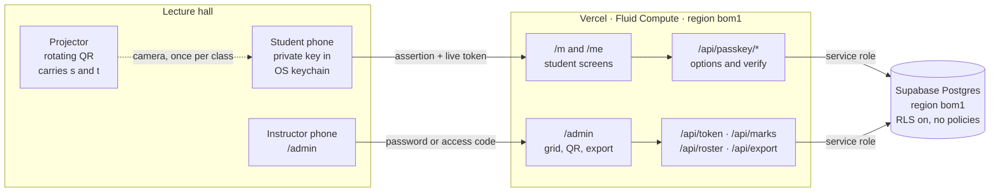
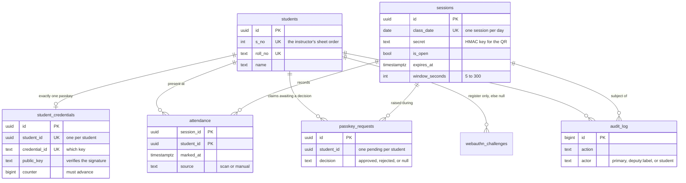
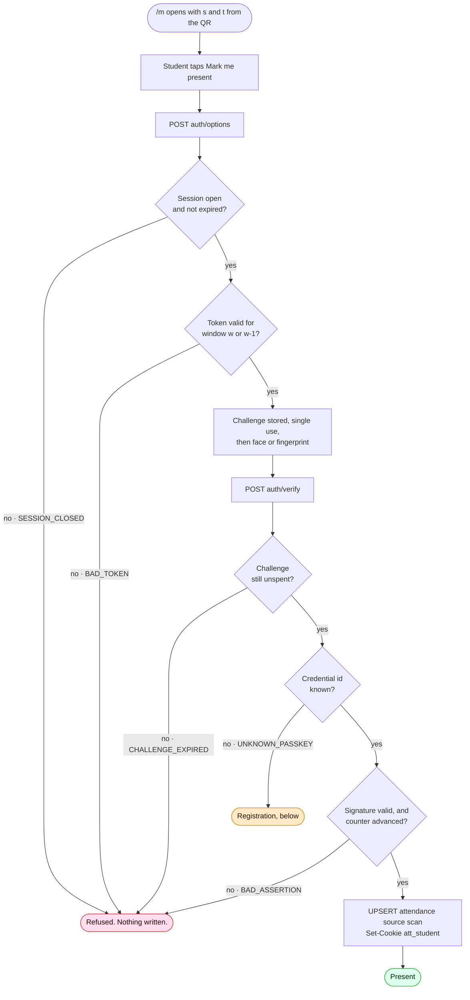
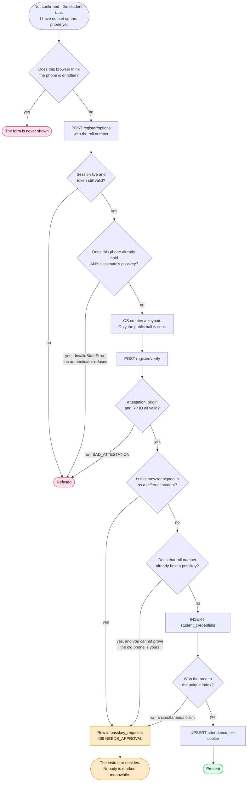
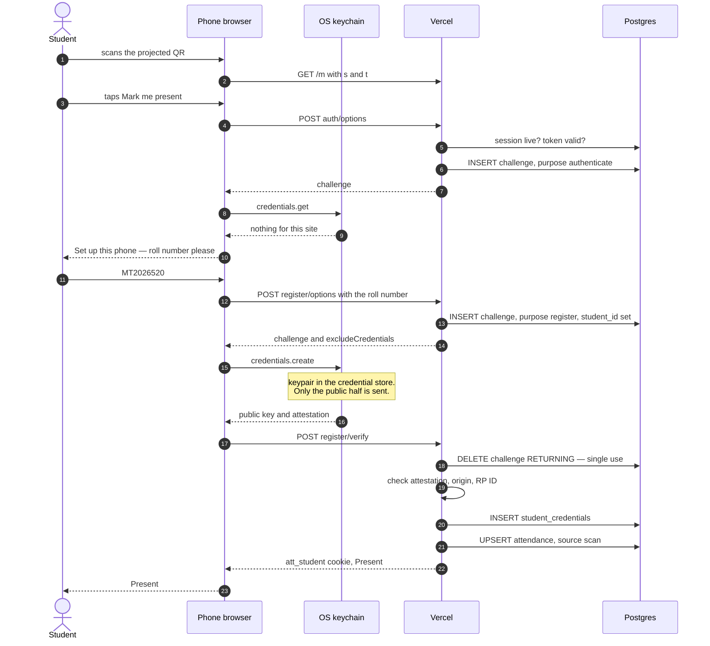
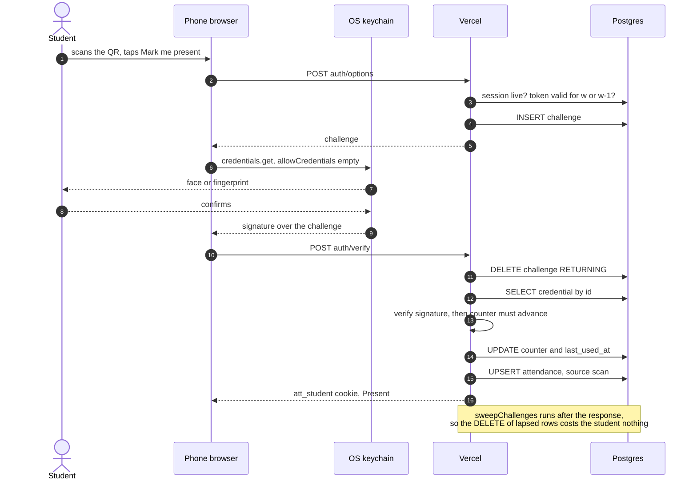
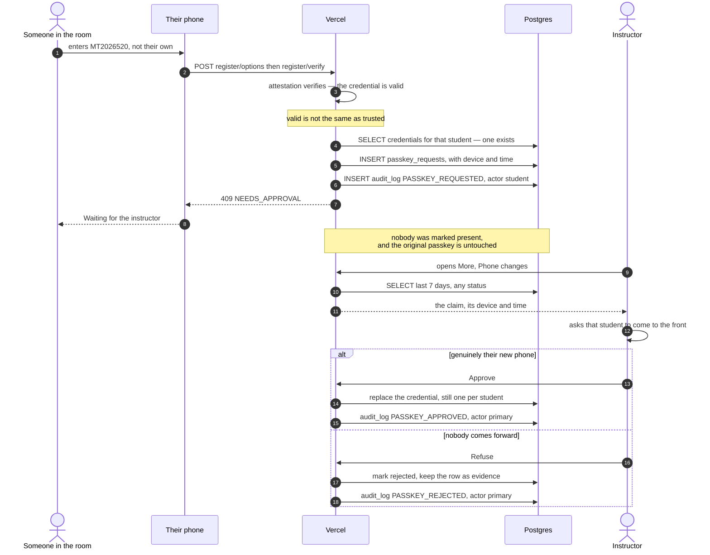
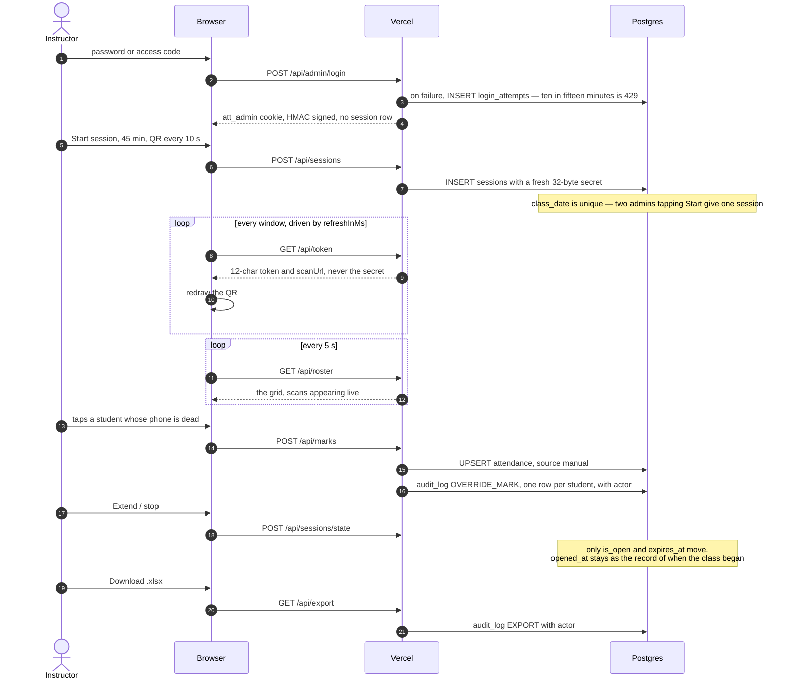

# Architecture and flows

The shape of the system, the data model, the flows through it, and the numbered decisions behind them.

[← back to the README](../README.md)

## The shape of the system

Three actors, one server, one database. The projector and the phone never talk to
each other over the network — the QR is the only channel between them, and that
is the point: it cannot be relayed without being re-photographed.

Everything server-side talks to Postgres with the service role key and RLS is on
with **no policies**, so a leaked anon key grants nothing. There is no auth
library and no session table: the admin cookie and the student cookie are both
self-describing and HMAC-signed, so a request needs one database read fewer.

### Data model

Three constraints do work that application code would otherwise have to
remember, and would get wrong under concurrency:

- `attendance` is keyed on `(session_id, student_id)`, so double-marking is not
  something to guard against — it is not expressible.
- `sessions.class_date` is `unique`, so two admins tapping **Start** at the same
  moment produce one session, not two.
- `student_credentials` has a unique index on `student_id`, so three simultaneous
  claims on one roll number produce one credential. A check-then-insert has a
  window here, and it was measured letting **two of three** through.

## How it flows

The first two diagrams are the **decision logic** — every check, in the order the
server applies it, and what each refusal returns. The four after them are
**sequences**, which answer a different question: who talks to whom, how many
round trips it costs, and where the boundary between the browser and the OS
keychain falls. Same flows, deliberately different cross-sections.

### Marking present, when the phone already has a passkey

The ordinary case, and the one that happens 46 times out of 47. Two round trips,
because WebAuthn needs a challenge before the biometric and a signature after it.
Each refusal carries the code the screen has copy for.

Note what this does **not** contain: any path where typing a roll number alone
marks somebody present, and any path from the cookie to the `attendance` table.
Both are deliberate — see decision 5, **Bearer tokens read, signatures write**.

### Getting a passkey in the first place

Reached only by a deliberate tap after a failed prompt — never as the place a
cancelled fingerprint dialog lands you, which is the bug this shape exists to
prevent. The roll number is asked for exactly once in the term.

Three of these gates were added after one phone was found collecting passkeys for
classmates who had not enrolled: the local flag, the authenticator's exclusion
check, and the signed-in-as-someone-else check. The fork at the bottom is the
older argument and still the main one — claiming an *unclaimed* roll number needs
only presence, claiming one that is already taken needs a person.

### A student's first class

Now the same journey as a sequence, because the interesting part is not the
branching but the **two round trips and the keychain boundary** — where the
keypair is made, and what crosses back to the server.

The roll number is typed exactly once in the term, and it is a *label*, not a
key. The phone generates the identity; the roll number only decides which
`student_id` gets written into the passkey.

### Every later class

Nothing is typed, and the roll number is never sent again. The passkey is
discoverable, so its `userHandle` tells the server who signed — which is also why
`allowCredentials` is empty and this endpoint leaks nothing about who is enrolled.

### A contested roll number

The case that reshaped the design. A stranger in the room holding the live QR
types a classmate's roll number. The server cannot tell that apart from the
classmate's own new phone, so it stops guessing and asks a human.

### The instructor running a class

Marking by hand is deliberately **not** gated on the session being open: the grid
has to stay editable after class, and a backdated session is created closed so it
never has a QR at all. Scanning is gated on all three of a live session, a live
token and a signature.

## Architectural decisions

The reasoning behind each of these is in the sections below; this is the index.
Every one was either measured or arrived at by breaking the previous version.

| # | Decision | Why | Where |
|---|---|---|---|
| 1 | **Postgres is the source of truth.** Excel is generated on demand, never written to at runtime. | A spreadsheet cannot be read concurrently by 47 phones, and a file that is both input and output has no answer for "which copy is right". | [Export](running-a-class.md#export) |
| 2 | **No auth library.** The admin is one password in an env var; both cookies are self-describing and HMAC-signed. | There is one admin and no sign-up, no reset, no roles beyond deputy. A library would add a dependency and a session table to solve problems this app does not have. | [Cookies and HTTPS](security.md#cookies-and-https) |
| 3 | **Identity is a passkey**, after a localStorage UUID and then an httpOnly cookie. | Both predecessors were bearer tokens — copyable, forwardable, and destroyable by Safari's 7-day cap. A passkey cannot be read by a page or handed to a friend, and using it needs the device unlock. | [Why identity moved…](identity.md#why-identity-moved-from-localstorage-to-a-cookie-to-passkeys) · [What "the key never leaves the phone" actually means](identity.md#what-the-key-never-leaves-the-phone-actually-means) |
| 4 | **Two independent proofs to be marked present:** *who* is a signature, *where* is a live rotating token. | Neither substitutes for the other. A passkey off campus proves identity but not presence; a photographed QR proves presence but not identity. | [Identity](security.md#identity) |
| 5 | **Bearer tokens read, signatures write.** The `att_student` cookie can fetch `/me` and nothing else. | The cookie is copyable and a friend *can* paste it — accepted, because its whole power is reading one student's own percentage. Attendance always needs a fresh assertion. | [Identity](security.md#identity) |
| 6 | **One passkey per student, enforced by a unique index** rather than by checking first. | Postgres has no race window; check-then-insert does, and it let two of three simultaneous claims through when tested. | [Guarding the credentials](security.md#guarding-the-credentials) |
| 7 | **An approval queue, not a reset button.** | A lost phone and a stranger's phone are indistinguishable to the server. So a person decides, and every refused claim becomes evidence with a device and a time on it. | [Lost or wiped phone](running-a-class.md#lost-or-wiped-phone) |
| 8 | **The queue shows facts, not guesses.** No "already marked today", no "old phone last used". | Neither discriminates: a proxy attempt happens while the student is absent, and so does a genuine lost phone. A hint that only fires in the rare case invites trusting it instead of asking the student. | [The phone-changes panel](running-a-class.md#the-phone-changes-panel) |
| 9 | **Registration is authorised by presence**, not by an admin-controlled window. **Partly wrong** — the window was removed on reasoning that did not hold, and the gap it left is still open. | Holding a live QR token does mean being in the room, and that part stands. But the case the window defended was called "self-correcting" when it is not: the victim is marked *present*, so nobody complains and nothing surfaces. | [Registration, and the window that was wrong to remove](security.md#registration-and-the-window-that-was-wrong-to-remove) |
| 17 | **The private-browsing enrolment route is accepted, not fixed.** No enrolment gate. | Every remaining fix costs the instructor time in every class, or an email pipeline, against an attack that is deliberate, limited to roll numbers nobody has enrolled, self-revealing when the real student tries to enrol, and committed in a room with the instructor in it. Detection is proportionate here; prevention is not. Decided 2026-08-25. | [What is accepted, and why](security.md#what-is-accepted-and-why) |
| 16 | **One passkey per device**, via `excludeCredentials` carrying the whole class. | `UNIQUE(student_id)` gave one passkey per student and nothing gave one per device, so a single handset could collect a passkey for every unenrolled classmate and mark them present all term. Enforced by the authenticator, so it stops a phone and not a script. | [One phone, many roll numbers](security.md#one-phone-many-roll-numbers) |
| 10 | **Housekeeping runs behind the response** via `after()`, with no cron. | Both swept tables are self-limiting by query, so the deletes are tidying, not correctness — and have no business costing a student a round trip. One less thing that can silently stop running. | [The phone-changes panel](running-a-class.md#the-phone-changes-panel) |
| 11 | **RLS on with no policies.** Every server query uses the service role. | A leaked anon key then grants nothing at all, rather than whatever the policies happen to permit. | [Permissions](security.md#permissions) |
| 12 | **The roster is cached in memory for 30 seconds**, and any write clears it. | Read on nearly every request, changed a handful of times a term. Thirty seconds and not thirty minutes because several serverless instances cannot tell each other about a new student. | [Caching](running-a-class.md#caching) |
| 13 | **The function region is pinned next to the database.** | Left at the default, compute ran in Washington against a database in Mumbai: nine sequential round trips made sign-in 2800 ms. Pinning it to `bom1` took that to 305 ms. | [Function region](running-a-class.md#function-region) |
| 14 | **The audit log records human decisions, not scans.** | 47 scans a class would bury the six overrides that someone might actually have to justify. The `attendance` row with `source = 'scan'` is the record of a scan. | [The audit log](security.md#the-audit-log) |
| 15 | **QR rotation speed is the only real control over relaying.** | No identity mechanism stops a student photographing the QR for an absent friend who then signs with their own face. Ten seconds gives a 10–20 s usable window against a 15–30 s realistic relay. | [What none of this fixes](identity.md#what-none-of-this-fixes) |
